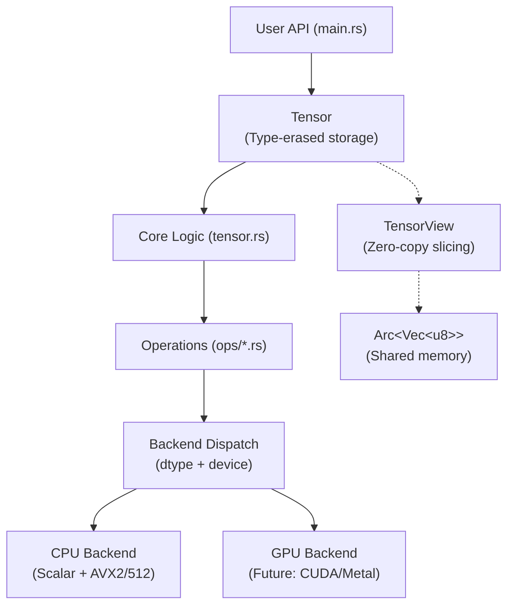

# Cobalt: Rust Deep Learning Framework (From Scratch)

## 1. Overview

Cobalt is an educational deep learning framework built entirely from scratch in Rust. It demonstrates how modern ML frameworks work under the hood—from raw memory management to SIMD optimizations—without relying on external ML libraries.

**Philosophy**: Learn by building. Every line of code teaches something about systems programming, numerical computing, or deep learning architecture.

## 2. Purpose & Goals

Build a complete deep learning framework including:
- **Tensor abstraction**: Multi-dimensional array with 16 data types
- **Operations**: Elementwise, MatMul, activations, reductions
- **Memory management**: Zero-copy views with Arc-based shared storage
- **Autograd**: Dynamic computation graphs (Phase 2)
- **Neural network layers**: Linear, Conv2D, normalization (Phase 2+)
- **Optimizers**: SGD, Adam, AdamW (Phase 2+)
- **Backend support**: CPU (AVX2/AVX512), GPU (CUDA/Metal future)

## 3. Architecture Overview



### Key Design Decisions

1. **Type Erasure**: `Tensor` stores data as `Arc<Vec<u8>>` rather than generic `Tensor<T>`. This enables dynamic dispatch and matches PyTorch's architecture.

2. **Arc-based Memory**: Shared ownership via atomic reference counting allows zero-copy views and efficient memory sharing.

3. **Strided Layouts**: Views use strides for zero-copy transpose, slice, and reshape operations.

4. **Backend Abstraction**: Operations dispatch to CPU/GPU backends based on `(dtype, device)` metadata.

## 4. Current Status (Phase 0-1 Complete)

### Phase 0: Core Operations ✅
- **16 Data Types**: FP32/64/16/BF16, INT/UINT 8/16/32/64, BOOL
- **Elementwise Ops**: Add, Multiply with broadcasting
- **Matrix Operations**: 2D MatMul (naive O(n³))
- **Activations**: ReLU (with integer support), Softmax (numerically stable)
- **Broadcasting**: NumPy-compatible shape expansion
- **SIMD**: AVX2/AVX512 optimizations for FP32
- **Testing**: 32 comprehensive tests (100% passing)

### Phase 1: Views & Slicing ✅
- **TensorView**: Zero-copy views with Arc-shared memory
- **Slicing**: Single and multi-dimensional slicing
- **Transpose**: Zero-copy dimension swapping
- **Permute**: Arbitrary axis reordering
- **Reshape/Flatten**: With contiguity requirements
- **Squeeze/Unsqueeze**: Add/remove size-1 dimensions
- **Contiguity**: Detection and materialization
- **Testing**: 7 view tests + integration tests

### Performance Benchmarks (Release Mode)
| Operation | Size | Time | Throughput |
|-----------|------|------|------------|
| Add (FP32) | 10,000 | 38.6 µs | 259M ops/sec |
| Mul (FP32) | 10,000 | 1.9 µs | 5,263M ops/sec |
| MatMul (FP32) | 128×128 | 1.26 ms | 3.32 GFLOPS |
| ReLU (FP32) | 5 | <1 µs | - |
| Softmax (FP32) | 3 | <1 µs | - |

## 5. Project Structure

```
cobalt/
├── src/
│   ├── lib.rs              # Library exports
│   ├── main.rs             # Demo program (575 lines)
│   ├── tensor.rs           # Tensor struct + API
│   ├── views.rs            # TensorView implementation
│   ├── dtype.rs            # 16 data types
│   ├── device.rs           # CPU/GPU enum
│   ├── errors.rs           # Error types
│   ├── broadcast.rs        # Broadcasting logic
│   ├── backend/
│   │   ├── mod.rs          # Backend interfaces
│   │   ├── ops.rs          # Operation dispatch
│   │   └── cpu/
│   │       ├── mod.rs      # CPU backend
│   │       ├── add.rs      # Addition kernels
│   │       ├── mul.rs      # Multiplication kernels
│   │       ├── matmul.rs   # Matrix multiplication
│   │       ├── relu.rs     # ReLU activation
│   │       ├── softmax.rs  # Softmax
│   │       ├── add_avx2.rs # AVX2 SIMD
│   │       └── add_avx512.rs # AVX512 SIMD
│   └── ops/
│       ├── mod.rs          # Ops module exports
│       ├── elementwise.rs  # Add, Mul dispatchers
│       ├── matmul.rs       # MatMul dispatcher
│       ├── activation.rs   # ReLU dispatcher
│       └── softmax.rs      # Softmax dispatcher
├── notes/
│   ├── index.md            # Learning guide
│   ├── intro.md            # This file
│   ├── 010-tensors.md      # Tensor fundamentals
│   ├── 015-datatypes.md    # Type system
│   ├── 020-shapes-and-math.md
│   ├── 030-ops-architecture.md
│   ├── 040-elementwise.md
│   ├── 050-matmul.md
│   ├── 060-activations-softmax.md
│   ├── 070-broadcasting.md
│   ├── 080-views-and-slicing.md
│   ├── 085-view-implementation.md
│   ├── 090-python-bindings.md
│   ├── 095-contiguity-materialization.md
│   ├── 105-tensor-architecture.md
│   └── 110-phase-0-1-guide.md
├── Cargo.toml
└── README.md
```

## 6. Getting Started

### Prerequisites
```bash
# Rust 1.70+ with cargo
rustc --version

# CPU with AVX2 or AVX512 (for SIMD optimizations)
# Falls back to scalar if not available
```

### Quick Start
```bash
# Clone and navigate
cd cobalt

# Run demo (shows all features)
cargo run --release

# Run tests
cargo test --release

# Build documentation
cargo doc --open
```

### First Tensor
```rust
use cobalt::{Tensor, DType};

// Create a 2×3 matrix of floats
let t = Tensor::from_f32(
    vec![1.0, 2.0, 3.0, 4.0, 5.0, 6.0],
    vec![2, 3]
);

// Add tensors
let a = Tensor::from_f32(vec![1.0, 2.0], vec![2]);
let b = Tensor::from_f32(vec![3.0, 4.0], vec![2]);
let c = a.add(&b)?; // [4.0, 6.0]

// Matrix multiplication
let m1 = Tensor::from_f32(vec![1.0, 2.0, 3.0, 4.0], vec![2, 2]);
let m2 = Tensor::from_f32(vec![5.0, 6.0, 7.0, 8.0], vec![2, 2]);
let result = m1.matmul(&m2)?;

// Zero-copy views
let view = t.slice(0, 1)?;  // First row
let transposed = t.transpose_view(0, 1)?;
```

## 7. Learning Path

**For Users** (want to use Cobalt):
1. Read [110-phase-0-1-guide.md](110-phase-0-1-guide.md) - Complete reference
2. Run `cargo run --release` - See demos
3. Check [070-broadcasting.md](070-broadcasting.md) - Shape rules
4. Review [085-view-implementation.md](085-view-implementation.md) - Views

**For Developers** (want to understand internals):
1. [010-tensors.md](010-tensors.md) - Fundamentals
2. [020-shapes-and-math.md](020-shapes-and-math.md) - Memory layout
3. [030-ops-architecture.md](030-ops-architecture.md) - Design patterns
4. [065-shared-memory-arc.md](065-shared-memory-arc.md) - Memory management
5. [105-tensor-architecture.md](105-tensor-architecture.md) - System architecture

**For Contributors** (want to extend):
1. [110-phase-0-1-guide.md § 9](110-phase-0-1-guide.md#9-extending-the-system)
2. [030-ops-architecture.md](030-ops-architecture.md)
3. Review `src/ops/` and `src/backend/cpu/` for patterns

See [notes/index.md](notes/index.md) for complete learning tracks.

## 8. Design Philosophy

### Educational First
- **No black boxes**: Every algorithm is implemented from scratch
- **Well-documented**: ~10,000 lines of markdown documentation
- **Readable code**: Prioritizes clarity over extreme optimization
- **Progressive complexity**: Start simple, add optimizations incrementally

### Systems-Level Learning
- **Manual memory management**: Understand storage, strides, offsets
- **SIMD intrinsics**: Learn AVX2/AVX512 assembly-level programming
- **Type systems**: Master Rust's generic system and trait bounds
- **Zero-cost abstractions**: Views that compile to raw pointer arithmetic

### Production-Ready Patterns
- **Error handling**: Explicit `Result<T, E>` types, no panics in library code
- **Type safety**: No `unsafe` except in well-audited SIMD code
- **Testing**: 39 unit tests with 100% pass rate
- **Benchmarking**: Release builds with performance tracking

## 9. Target Features & Roadmap

### Phase 0: Core Operations ✅ COMPLETE
- [x] Tensor struct with 16 dtypes
- [x] Add, Mul with broadcasting
- [x] MatMul (2D, naive)
- [x] ReLU, Softmax activations
- [x] AVX2/AVX512 SIMD
- [x] Comprehensive testing

### Phase 1: Views & Slicing ✅ COMPLETE
- [x] Arc-based shared memory
- [x] TensorView with strides
- [x] Slice, transpose, permute
- [x] Reshape, flatten
- [x] Contiguity detection
- [x] Materialization

### Phase 1.5: Extended Operations (Next)
- [ ] Reduction ops (sum, mean, max, min)
- [ ] Batched MatMul (3D+)
- [ ] Optimized MatMul (tiling, blocking)
- [ ] More activations (GELU, Sigmoid, Tanh)
- [ ] Parallel CPU ops (Rayon)

### Phase 2: Autograd (Future)
- [ ] Dynamic computation graph
- [ ] Reverse-mode autodiff
- [ ] Gradient accumulation
- [ ] Parameter groups

### Phase 3: Neural Networks (Future)
- [ ] Linear layers
- [ ] Conv2D (im2col approach)
- [ ] Batch normalization
- [ ] Dropout

### Phase 4: Training (Future)
- [ ] SGD optimizer
- [ ] Adam/AdamW
- [ ] Learning rate schedulers
- [ ] Mini-batch training loops

### Phase 5: Advanced (Future)
- [ ] GPU backend (CUDA/Metal)
- [ ] Python bindings (PyO3)
- [ ] Model serialization
- [ ] Distributed training

## 10. Why Rust?

### Performance
- **Zero-cost abstractions**: Generic code compiles to specialized machine code
- **Memory safety**: No garbage collector overhead
- **SIMD**: Direct access to AVX2/AVX512 intrinsics
- **Inline optimization**: Aggressive inlining across modules

### Safety
- **No null pointer crashes**: Option<T> instead of null
- **No data races**: Borrow checker prevents concurrent mutation
- **Explicit errors**: Result<T, E> makes errors visible
- **No undefined behavior**: Strict memory model

### Developer Experience
- **Type inference**: Write less boilerplate
- **Pattern matching**: Elegant error handling
- **Cargo**: Modern package manager and build system
- **Documentation**: First-class support with `cargo doc`

### Educational Value
- **Explicit control**: See every allocation, every copy
- **Modern systems language**: Applicable beyond ML
- **Growing ecosystem**: WASM, embedded, systems programming

## 11. Comparison to Other Frameworks

| Feature | Cobalt | PyTorch | TensorFlow | JAX |
|---------|--------|---------|------------|-----|
| Language | Rust | Python/C++ | Python/C++ | Python/XLA |
| Autograd | Phase 2 | ✅ | ✅ | ✅ |
| GPU | Phase 5 | ✅ | ✅ | ✅ |
| Views | ✅ | ✅ | ✅ | ✅ |
| SIMD | ✅ | ✅ | ✅ | ✅ |
| Educational | ✅✅✅ | ❌ | ❌ | ⚠️ |
| Production | Phase 5 | ✅ | ✅ | ✅ |

**Cobalt's niche**: Educational depth and systems-level understanding.

## 12. Testing Strategy

### Unit Tests (39 passing)
- **Creation tests**: Verify tensor construction
- **Operation tests**: Test each op with multiple dtypes
- **Broadcasting tests**: NumPy compatibility
- **Error tests**: Explicit error handling
- **View tests**: Zero-copy verification
- **Integration tests**: Multi-operation workflows

### Performance Tests
- **Benchmarking**: Release mode measurements
- **SIMD verification**: Compare scalar vs AVX
- **Memory profiling**: Check for leaks
- **Contiguity tests**: Ensure materialization works

### Running Tests
```bash
# All tests
cargo test

# Specific module
cargo test views
cargo test broadcast

# Release mode (optimizations)
cargo test --release

# With output
cargo test -- --nocapture
```

## 13. Contributing

### Adding Operations
See [110-phase-0-1-guide.md § 9.1](110-phase-0-1-guide.md#91-adding-a-new-operation) for step-by-step guide.

### Code Style
- Follow Rust conventions (`rustfmt`)
- Add tests for new features
- Document public APIs with `///`
- Update relevant markdown notes

### Documentation
- Create notes following the existing structure
- Include motivation, examples, code, debugging tips
- Update [index.md](index.md) learning paths
- Add to [110-phase-0-1-guide.md](110-phase-0-1-guide.md) if applicable

## 14. FAQ

**Q: Why not use ndarray or tch-rs?**
A: Educational goals. We learn more by implementing from scratch.

**Q: Is this production-ready?**
A: Phase 0-1 is solid for CPU inference. GPU and autograd are future work.

**Q: Why AVX instead of portable-simd?**
A: portable-simd is unstable. We use runtime CPU detection to fall back gracefully.

**Q: Can I use this for research?**
A: For educational experiments, yes. For production research, use PyTorch.

**Q: How does broadcasting work?**
A: See [070-broadcasting.md](070-broadcasting.md) for complete explanation.

**Q: What about Python integration?**
A: Planned for Phase 5 using PyO3. See [090-python-bindings.md](090-python-bindings.md).

## 15. Resources

### Documentation
- [notes/index.md](notes/index.md) - Learning guide
- [110-phase-0-1-guide.md](110-phase-0-1-guide.md) - Implementation reference
- `cargo doc --open` - API documentation

### External References
- [Rust Book](https://doc.rust-lang.org/book/)
- [Intel Intrinsics Guide](https://www.intel.com/content/www/us/en/docs/intrinsics-guide/index.html)
- [NumPy Broadcasting](https://numpy.org/doc/stable/user/basics.broadcasting.html)
- [PyTorch Internals](http://blog.ezyang.com/)

### Cobalt-Specific
- [Design Decisions](105-tensor-architecture.md)
- [Memory Management](065-shared-memory-arc.md)
- [SIMD Optimizations](040-elementwise.md)
- [View System](085-view-implementation.md)

## 16. License & Acknowledgments

**License**: MIT (to be added)

**Inspiration**:
- PyTorch's dispatcher architecture
- NumPy's broadcasting semantics
- Rust's ownership model
- Educational frameworks: micrograd, tinygrad

**Built with**:
- Rust 1.70+
- half (FP16/BF16 support)
- No external ML dependencies

## 17. Contact & Community

**GitHub**: (repository link to be added)
**Issues**: Bug reports and feature requests welcome
**Discussions**: Architecture questions and learning support

---

**Status**: Phase 0-1 Complete (February 2026)
**Next**: Phase 1.5 (Reduction operations, optimized MatMul)

**Ready to learn?** Start with [notes/index.md](notes/index.md) or run `cargo run --release`!
