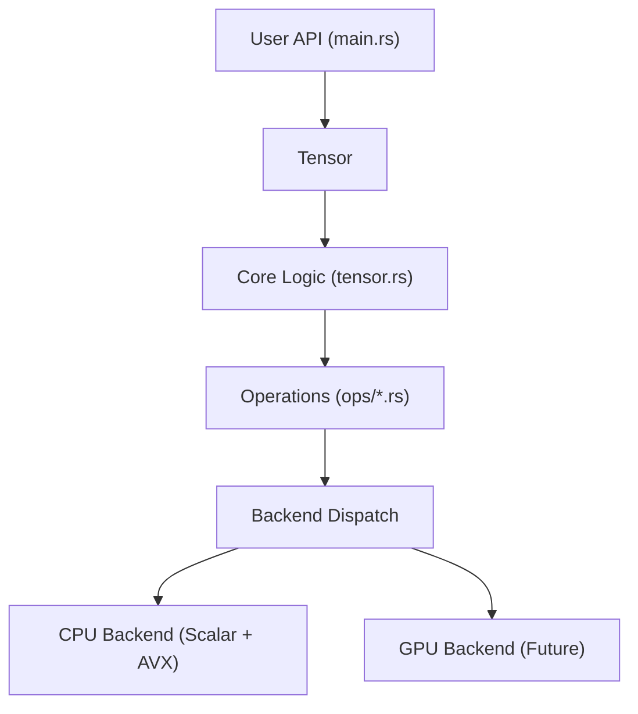

# Cobalt: Rust Deep Learning Framework (From Scratch)

## Purpose
Build a small deep learning framework in Rust from scratch, including:
- Tensor abstraction
- Autograd (dynamic)
- Neural network layers
- Optimizers
- Image pipeline
- Training loops
- Future backend support (CUDA)

### Architecture Overview

## Starting Position
This project is intentionally handcrafted for educational depth.
No external ML frameworks will be used initially.

## Target Features (Phase 0.1)
- Tensor struct
- Basic ops: add, mul, matmul
- Dynamic computation graph
- Reverse-mode autodiff
- SGD optimizer
- CPU backend

## Future Phases
- Conv2D
- Adam optimizer
- Image dataset loaders
- CLI inference tool
- Serialization
- Backend trait
- CUDA backend
